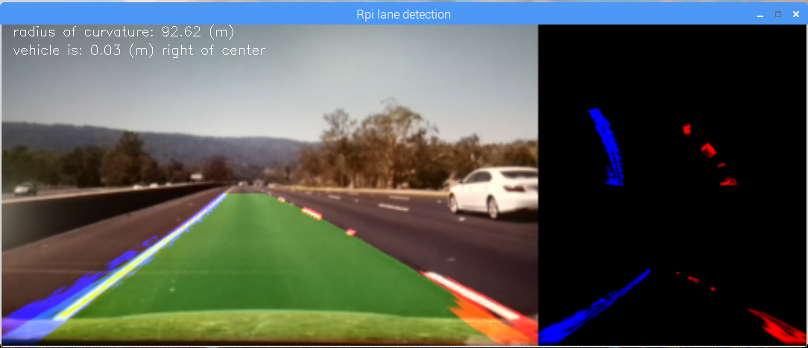

### Lane detection using Raspberry Pi
This is a modified/optimized version of the Udacity Advanced Lane Detection project.

Requirements:
- picamera
- open cv3
- numpy

 Installation:
- miniconda  (optional): https://conda.io/docs/install/quick.html#linux-miniconda-install
- python     (used version 3.4)
- numpy      (used version 1.9.2)
- picamera   (used version 1.13)
- open cv3 for raspberry pi: check the opencv-install folder/readme

Run:
- python lane-detect-pi.py (use sample-video.mp4)

Performance:
- 7 fps

Sample output:

